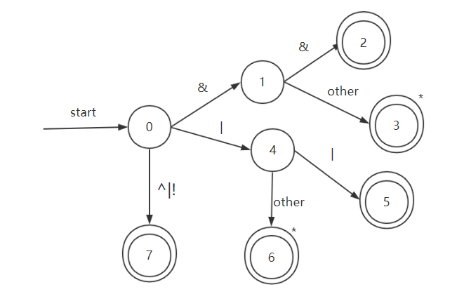
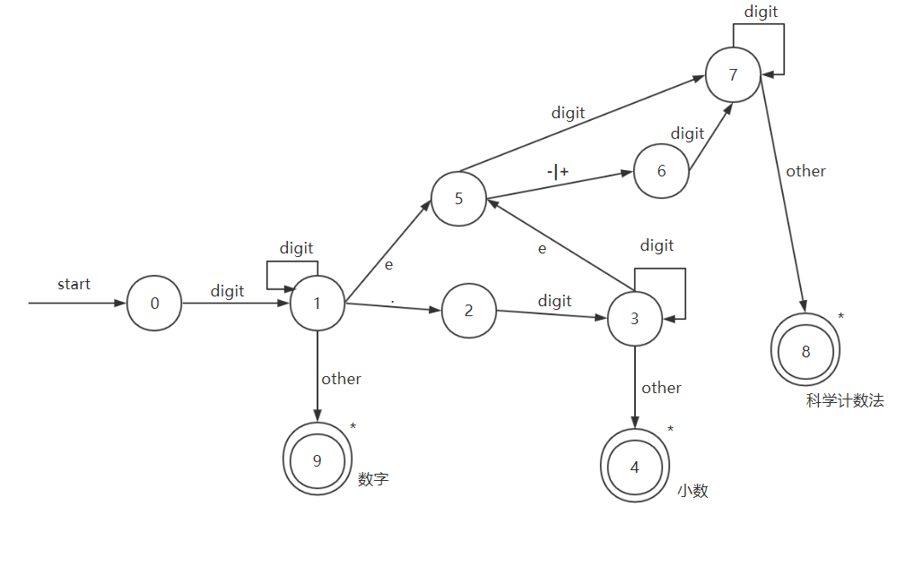
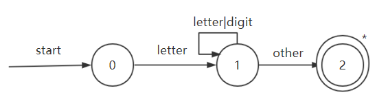
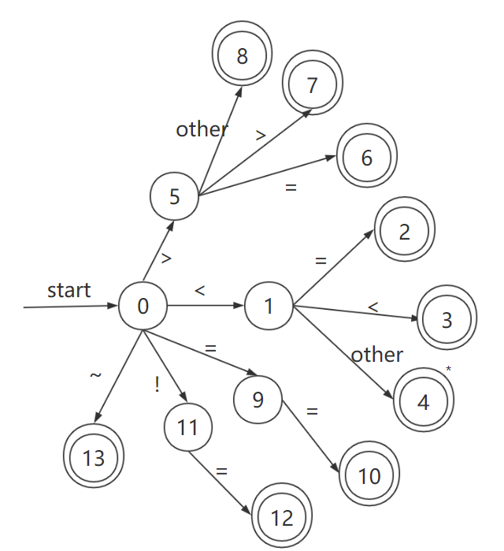

# c-compiler

这是一个基于 vue2.0,使用 vue-cli3 搭建的简易的 C 语言编译器项目。

## 编译器介绍

编译器分为 6 部分,分别为|

- 词法分析
- 语法分析
- 语义分析
- 中间代码生成
- 代码优化
- 目标代码生成

---

## 模块介绍

### 1. 词法分析器

#### 基本正则表达式

| 名称              | 正则表达式(...代表规律推广) |
| ----------------- | --------------------------- |
| letter            | \_\|[A-Za-z]                |
| digit             | [0-9]                       |
| digits            | digit+                      |
| optional_fraction | (. digits)?                 |
| optional_exponent | (e(+\|-)?digits)?           |

#### 可识别的 Token 种类

| Token 常量名      | 正则表达式                                 | 描述             | 词素                                                                                                                                                                                                  |
| ----------------- | ------------------------------------------ | ---------------- | ----------------------------------------------------------------------------------------------------------------------------------------------------------------------------------------------------- |
| ID                | letter(letter\|digit)\*                    | 用户自定义标识符 | 例如 a,b,c                                                                                                                                                                                            |
| NUMBER            | digits optional_fraction optional_exponent | 数字             | 1,5.6,1.5e6,465e-1                                                                                                                                                                                    |
| RELATION_OPERATOR | (<=?)\|(>=?)\|(==)\|(!=)                   | 关系运算符       | \<, <=, >, >=, ==, !=                                                                                                                                                                                 |
| MATH_OPERATOR     | ((++?)\|(--?))\|/\|\*\|%                   | 算术运算符       | +, -, /, \*, %, ++, --                                                                                                                                                                                |
| LOGIC_OPERATOR    | (&&?)\|(\|\|?)\|^\|!                       | 逻辑运算符       | &, \|, &&, \|\|, ^, !                                                                                                                                                                                 |
| BIT_OPERATOR      | (>>)\|(<<)\|~                              | 位运算符         | >>, <<,~                                                                                                                                                                                              |
| DELIMITERS        | {\|}\|(\|(\|)\|[\|]                        | 括号分隔符       | {, }, (, ), [, ]                                                                                                                                                                                      |
| ASSIGNMENT        | =                                          | 赋值符           | \=                                                                                                                                                                                                    |
| SECMICOLON        | ;                                          | 分号             | ;                                                                                                                                                                                                     |
| COMMA             | ,                                          | 逗号运算符       | ,                                                                                                                                                                                                     |
| TERNARY_OPERATORS | ?\|:                                       | 三目运算符       | ?,:                                                                                                                                                                                                   |
| KEYWORDS          | (auto)\|(break)\|...\|(volatile)\|(while)  | 关键字和保留字   | auto,break,case,char,const,continue,default,do,double,else,enum,extern,float,for,goto,if,int,long,register,return,short,signed,sizeof,static,struct,switch,typedef,union,unsigned,void,volatile,while |

PS:每个关键字自成一个 Token,表格为方便起见，因此写到了一行。

#### 代码中所用状态转换图

此处代码位置:src/compiler/lexer.js

| 方法名                   | 描述                               | 状态图                                                      |
| ------------------------ | ---------------------------------- | ----------------------------------------------------------- |
| getLogicOperator         | 获取逻辑运算符 token               |                 |
| getNum                   | 获取数字 Token                     |                      |
| getWord                  | 获取关键字或用户自定义标识符 token |                        |
| getBitOrRelationOperator | 获取位运算符或关系运算符的 token   |  |
